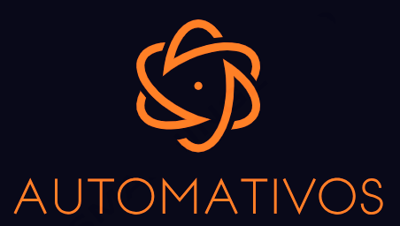

<div align="center">
  <a href="https://github.com/olvdan/Automativos">
    
  </a>
</div>

## Descrição do Projeto
<p align="center">A Automativos é uma aplicação desenvolvida para facilitar a administração e o acompanhamento dos ativos de uma empresa. Essa REST API oferece funcionalidades abrangentes para gerenciar informações sobre os ativos, permitindo a criação, atualização, exclusão e consulta de dados relacionados aos recursos da empresa.</p>

## Recursos Principais

#### 1. Listagem de Equipamentos

- **Endpoint:** `/equipamentos`
- **Método:** `GET`
- **Descrição:** Retorna uma lista de todos os equipamentos registrados na empresa.

#### 2. Adição de Equipamento

- **Endpoint:** `/equipamentos`
- **Método:** `POST`
- **Descrição:** Permite a adição de um novo equipamento ao registro da empresa.

#### 3. Atualização de Equipamento

- **Endpoint:** `/equipamentos/{patrimonio}`
- **Método:** `PUT`
- **Descrição:** Atualiza as informações de um equipamento existente com base no Patrimônio.

#### 4. Atualização Parcial de Equipamento

- **Endpoint:** `/equipamentos/{patrimonio}`
- **Método:** `PATCH`
- **Descrição:** Atualiza as informações, de forma parcial, de um equipamento existente com base no Patrimônio.

#### 5. Remoção de Equipamento

- **Endpoint:** `/equipamentos/{patrimonio}`
- **Método:** `DELETE`
- **Descrição:** Remove um equipamento do registro com base no Patrimônio.


## Construído com:

<table>
  <tr>
    <td><bold>Application</bold></td>
    <td><bold>Version</bold></td>
  </tr>
  <tr>
    <td>Java Maven</td>
    <td>11</td>
  </tr>
  <tr>
    <td>Spring tools suite 4</td>
    <td>4.20.1</td>
  </tr>
   <tr>
    <td>Java Json Tools</td>
    <td>1.12</td>
  </tr>
   <tr>
    <td>Jackson Databind</td>
    <td>2.15.3</td>
  </tr>
  <tr>
    <td>Spring Framework Boot</td>
    <td>3.1.5</td>
  </tr>

</table>


## Arquitetura:

### Estrutura do Projeto:

O projeto segue uma estrutura de classes, contendo entidade, controladores e serviços.

- `Equipamentos` (Entidade):
  - Classe representando os equipamentos registrados no sistema.
  - Atributos incluem patrimonio, tipo, marca, modelo, serialnumber e usuario.
  - Implementação de `equals` e `hashCode` baseada no campo `patrimonio`.

- `EquipamentosRepository` (Repositório):
  - Visa interagir com a entidade `Equipamentos` em um contexto de persistência usando Spring Data JPA.
  - Proporciona métodos padrão para operações CRUD no banco de dados.
  - Inclui métodos para verificação de existência de um registro com base no número de série. 
  
- `EquipamentosController` (Controlador):
  - Controlador REST para manipulação dos equipamentos no sistema.
  - Define endpoints para listar, adicionar, atualizar, atualizar parcialmente e excluir jogos.
  
- `EquipamentosService` (Serviço):
  - Implementa a lógica de negócios para as operações CRUD dos equipamentos.
  - Interage com o repositório `EquipamentosRepository` para acessar e modificar os dados.


### Explicação da Arquitetura:

O projeto adota uma arquitetura MVC (Model-View-Controller), onde as classes de entidade representam o modelo, os controladores definem endpoints para operações e os serviços encapsulam a lógica de negócios.

- **`Equipamentos`**: Representa os dados dos equipamentos e define métodos de comparação e hash para identificação.
- **`EquipamentosRepository`**: Interage com a entidade e proporciona métodos para operações CRUD no bando de dados.
- **`EquipamentosController`**: Gerencia as requisições HTTP, direcionando para os métodos apropriados no serviço.
- **`EquipamentosService`**: Contém a lógica para operações de listagem, adição, atualização, atualização parcial e exclusão de equipamentos. Interage com o repositório para persistência.

### Observações de Implementação:

 O sistema utiliza boas práticas de desenvolvimento, como tratamento de exceções e anotações para mapeamento de endpoints e entidades.

 Nota: O código fornecido é uma representação simplificada e pode conter mais elementos que não foram incluídos neste resumo.


 ## Instalação:

**Clonar repositorio**

```
git clone https://github.com/olvdan/Automativos.git
```

## Contato:

> Nome: Daniel de Oliveira
>
> R.A: 202103430
>
> Email: dannoliveira_@hotmail.com
>
> LinkedIn: [(link)](https://www.linkedin.com/in/daniel-de-oliveira-b58a5117b/)
>
> Github: [(link)](https://github.com/olvdan)
>
> Link do projeto:  [(link)](https://github.com/olvdan/Automativos.git)


## Agradecimentos:

[**Universidade São Francisco - (USF)**](https://www.usf.edu.br/)

  [(voltar ao topo)]()